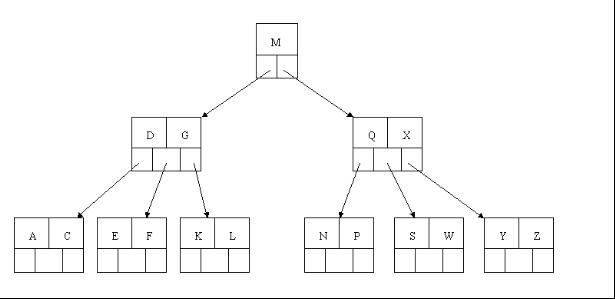

### **B-Tree**

B树、B+树都是大量运用于文件系统、数据库中的为实现的高效的磁盘存取而设计的多叉平衡搜索树。相比于平衡二叉树，B树因为是多叉树，所以树的深度更小，在磁盘查找领域，每一次查找代表着一次内存与磁盘的数据交换，由于树的深度更小，所以B树在这个领域的应用更多。

#### **B-Tree定义**

B树，又称为B-树，这两种树都是同一种树。

本文节点、结点不分。

一棵m阶的B满足下列条件：

1. 每个结点至多有m棵子树；
2. 除根节点外，其它每个分支节点至少有$\lceil m/2\rceil$棵子树；
3. 根节点至少有两棵子树（除非B树只有一个节点）
4. 所有叶节点在同一层上。B树的叶节点可以看成一种外部节点，不包含任何信息。
5. 有j个子节点的非叶节点恰好有j-1个关键字，关键字按递增次序排列。

#### **B-Tree查找结点**

B-Tree的查找方法与二叉树的查找有细微的区别，二叉树在当前节点不符合时只需要立即向左右节点查询，但B树需要先查询同一结点的其他元素。确定范围后再向下查找。

#### **B-Tree插入结点**

B树插入结点是一个自底向顶的过程，这点和红黑树类似。对高度为h的m阶B树，通常新节点都是插在第h层。当结点中关键字小于m-1时，直接插入。

当等于m-1时，需要对结点进行分裂。以中间关键字为界将结点一分为二，产生一个新的结点，并将中间关键字插入到父节点中。这样父节点就会多一个关键字空位，于是中间关键字左边的关键字指向中间关键字左边的子树，右边的则指向右边的子树。

同样，当父节点的关键字数量为m-1，进行同样的操作。最坏的情况是一直分裂到根结点，此时要建立一个新的根节点，B树增加一层。

至于中间结点，我的经验是如果插入前已经是奇数个，则在插入前就选择中间结点，否则插入后选中间结点。

代码：

#### **B-Tree删除结点**

删除结点首先需要找到结点，如果结点存在于树中。则继续操作。

如果要删除的是底层结点，则直接删除。

如果是中间结点，则将其删除后需要让子节点的元素顶替（这是让B树保持平衡的操作），这个元素是左子结点的最大元素或者右子结点的最小元素，这两个元素是离删除结点最近的元素。如下图的B树：

如果要删除T结点，则可以将W元素移到其父结点的位置，父结点的指向依然不变。

然后是删除后的情况，如果删除元素后本结点少于$\lceil m/2\rceil-1$个元素，而其有兄弟结点的元素数量大于$\lceil m/2\rceil-1$的话，则向其父结点借一个元素，父结点再向其兄弟结点取一个元素。

如果兄弟结点都不满足的话，则可以将该结点与兄弟结点合并。

对于下面的B树：

如果要删除E元素，则删除后需要进行合并，合并后得到下图

---

#### **References**

[B树详解](https://blog.csdn.net/v_july_v/article/details/6530142)