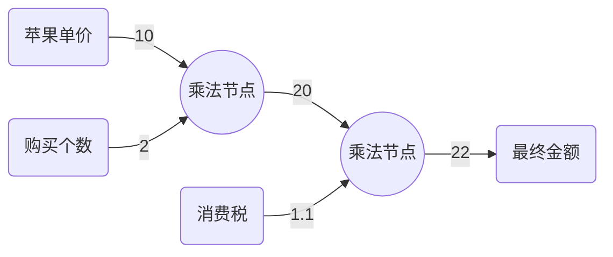

### 误差反向传播法

误差反向传播是一种能够搞高效计算权重参数梯度的方法.

#### 链式法则

**定义**: 如果某个函数由符合函数表示, 则该符合函数的导数可以用构成复合函数的导数的乘积表示.
$$
\frac{\partial z}{\partial x} = \frac{\partial z}{\partial y}\frac{\partial y}{\partial x}
$$

#### 反向传播

反向传播是一种通过计算结果反推每个变量对于最终结果影响因素的方法.

对于单价为10元的苹果, 买两个是20元, 如果有10%的消费税, 则最终需要支付22元.

则我们知道最终的金额由苹果单价, 购买个数和消费税三个因素影响. 但是我们不知道每个因素的影响因子是多少, 通过反向传播算法就可以求得.



上面的正向传播图只涉及到两个乘法节点, 对于乘法节点
$$
L = xy
$$
当x变化1单位时, 总体变化y个单位, 所以x的影响因子是y.

即为$\frac{\partial L}{\partial x}$

类比, 其它类型的节点同样也是通过求偏导数的方式求影响因子.

乘法层的实现:

```Python
class MulLayer:
    def __init__(self):
        self.x = None
        self.y = None
    def forward(self, x, y):
        self.x = x
        self.y = y
        out = x * y
        return out
    
    def backward(self, dout):
        dx = dout * self.y
        dy = dout * self.x
        return dx, dy
```

#### 激活函数层的实现

**ReLU(Rectified Linear Unit)**层

```python
class Relu:
    def __init__(self):
        self.mask = None
        
    def forward(self, x):
        self.mask = (x <= 0)
        out = x.copy()
        out[self.mask] = 0
        return out
    
    def backward(self, dout):
        dout[self.mask] = 0
        dx = dout
        return dx
```

Affine层的实现

有以下定理
$$
\frac{\partial L}{\partial X} = \frac{\partial L}{\partial Y}\cdot W^T\\
\frac{\partial L}{\partial W} = X^T\cdot\frac{\partial L}{\partial Y}
$$
