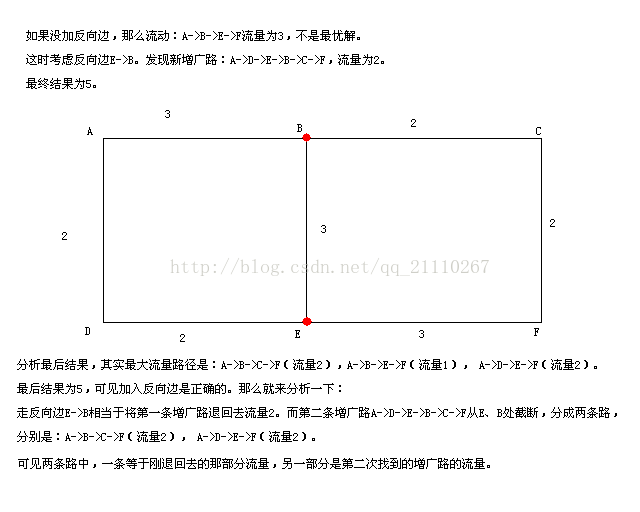

### **网络流算法**

网络流通常用于解决这样一类问题：在一个网络图中，所有的边都是有流量限制的。现有从图中一个点到另一个点的流量运输需求。要求找到一个可以满足运输需求，所有路程之和最短的线路。

#### **最大流**

同样是上面的那个问题，如果我们不计成本，要求在起点和终点之间运输尽可能多的货物，这时候就需要计算两个点之间的最大流量。

最大流最小割定力(Ford-Fulkerson, 1962)保证了在没有非负流量和非负客量限制的前提下，Ford-Fulkerson算法总是能够找到网络中的最大流。

##### **Ford-Fulkerson算法**

该算法主要包含了3个子算法思想：残差网络思想、增广路径思想、最大流最小割思想。

**残差网络$G_f$**

从u到v可以压入的额外流量就是流网络G中u,v的残留流量，容纳这些残留流量的边组成的子网络就是残差网络。残差网路的流量满足：$c_f(u,v) = c(u,v)-f(u,v)$

**增广路径**

残差网络$G_f$中从源点到汇点的一条简单路径。

增广路径的流量等于路径上所有边的残差流量的最小值

$$
c_f(p) = \min{c_f(u,v)|(u,v)\in p}
$$

**流网络的割**

在一个流网络中，它的割(S,T)将整个流网络分成两个部分，即S和T，其中T=G-S。如果存在一个流，穿过割(S,T)，即从子网络S流向子网络T，则我们称这个流为割的净流量。

最小割：一个流网络中净流量最小的割

**基本思想**

有了这三个概念，我们就可以正式通过Ford-Folkerson算法解题了

迭代算法：开始时任意找出从s到t的一条增广路p，往p上每条边的流量f加上残差流量，迭代此过程，更新每一对定点间网络流知道不存在增广路。

Ford-Fulkerson算法的上述实现被称为Edmonds-Karp算法，复杂度为O(VE^2^)。因为是通过BFS的方法寻找增广路径。

Edmonds-Karp算法的核心在于引入反向边，反向边的残差等于正向边残差的相反数。如果一条边既走了正向，又走了反向，则代表撤销之前走正向的决定。



如图，理论上的最大流是5, 分别为 A-B-C-F 流量2, A-B-E-F 流量1, A-D-E-F 流量2. 其中涉及到BE通道本为3的通行流量但是实际只用了1, 如果不引入反向边，很难知道这一点。所以，在我看来，引入反向边相当于在给了程序一个反悔的机制，但是这个反悔是另一次图遍历来完成的。如果图遍历时，一开始走的是 A-B-E-F，则整个图都被占据，无法加入其它流量。而A-D-E可以走 B-E 的反向边 E-B，流量为2, 到达F. 这就相当于原先的 A-B-E-F 分了流量2走 A-B-C-F, 而E-F就相当于空了2流量出来，因此可以 A-D-E-F 流量可以为2. 

```c++
#define maxn 250
#define INF 0x3f3f3f3f

struct Edge {
  int from, to, cap, flow;
  Edge(int u, int v, int c, int f) : from(u), to(v), cap(c), flow(f) {}

  void say() {
      printf("%c -> %c, cap: %d, flow: %d\n", (char)from, (char)to, cap, flow);
  }
};

struct EK {
    int v, e;             // v: number of vertex, e: number of edges.
    vector<Edge> edges;   
    vector<int> G[maxn];  // G: G[i] contains all indexes of edges start with i
    int a[maxn], p[maxn];

    void init(int n) {
        for (int i = 0; i < n; i++) G[i].clear();
        edges.clear();
    }

    void addEdge(char from, char to, int cap) {
        edges.push_back(Edge((int)from, (int)to, cap, 0));
        edges.push_back(Edge((int)to, (int)from, 0, 0));
        int m = edges.size();
        G[(int)from].push_back(m - 2);
        G[(int)to].push_back(m - 1);
    }

    int maxFlow(int s, int t) {
        int flow = 0;

        while (1) {
            memset(a, 0, sizeof(a));
            queue<int> q;
            q.push(s);
            a[s] = INF;

            while (!q.empty()) {
                int x = q.front();
                q.pop();

                for (int index: G[x]) {
                    Edge& edge = this->edges[index];
                    
                    if (!this->a[edge.to] && edge.cap > edge.flow) {
                        this->p[edge.to] = index;
                        this->a[edge.to] = min(this->a[x], edge.cap - edge.flow);
                        q.push(edge.to);
                    }
                }

                if (this->a[t]) {
                    break;
                }
            }

            if (!this->a[t]) {
                break;
            }

            for (int u = t; u != s; u = edges[p[u]].from) {
                edges[p[u]].flow += this->a[t];
                edges[p[u] ^ 1].flow -= this->a[t];
                edges[p[u]].say();
                edges[p[u] ^ 1].say();
            }
            printf("\n");
            flow += this->a[t];
        }
        return flow;
    }
};
```

同样，我们可以实现一个DFS实现的Ford-Fulkerson算法

##### **Dinic最大流算法**

Dinic算法比Edmonds-Karp算法更快，复杂度为O(EV^2^)。

**Dinic算法概述**:

1. 将残差图G初始化为给定图

2. 进行G的BFS构造一个level图，并检查是否更多的流量是可能的。一个顶点的level是该顶点到源的最短距离，以边的数量表示。

3. 如果不可能有更多的流量，则返回

4. 使用level图在G中发送多个流，直到达到阻塞流量

#### 费用流

费用流是指在网络流的基础上对每条边存在一个单位流量费用 $w(u,v)$，这条边的流量费用就是 $f(u,v)\times w(u,v)$，且 $w$ 同样满足斜对称性，即 $w(u,v) = -w(v,u)$.

最小费用最大流问题就是指在最大化 $\sum_{(u,v)\in E}f(u,v)$ 的前提下，最小化 $\sum_{(u,v)\in E}f(u,v)\times w(u,v)$.

##### SSP算法

SSP（Successive Shortest Path) 算法可用于求解最小费用最大流问题，在EK算法中，在进行图遍历时使用广度优先遍历，只要一条边还有流量就可以选择使用，但是在SSP中，我们选择优先流过费用更小的边。

```c++
#define maxn 250
#define INF 0x3f3f3f3f

struct Edge {
  int from, to, cap, flow, cost;
  Edge(int u, int v, int cap, int f, int cost) : from(u), to(v), cap(cap), flow(f), cost(cost) {}

  void say() {
      printf("%c -> %c, cap: %d, flow: %d\n", (char)from, (char)to, cap, flow);
  }
};

class SSP {
private:
    vector<Edge> edges;
    vector<int> edge_indice[maxn];
    int dis[maxn], pre[maxn], increase_flow[maxn];
    bool visited[maxn];
    int max_flow, min_cost;

public:
    void addEdge(char f, char t, int cap, int cost) {
        int from = (int)f, to = (int)t;
        this->edges.push_back(Edge(from, to, cap, 0, cost));
        this->edges.push_back(Edge(to, from, 0, 0, -cost));
        int size = edges.size();
        this->edge_indice[from].push_back(size - 2);
        this->edge_indice[to].push_back(size - 1);
    }

    pair<int, int> maxFlowMinCost(char start, char terminate) {
        this->max_flow = 0;
        this->min_cost = 0;
        int s = (int)start, t = (int)terminate;
        
        while (this->spfa(s, t))
            this->update(s, t);
        
        return make_pair(this->max_flow, this->min_cost);
    }

    int spfa(int s, int t) {
        memset(this->dis, INF, sizeof(this->dis));
        queue<int> q;
        q.push(s), this->dis[s] = 0; 
        this->increase_flow[s] = INF, this->increase_flow[t] = 0;

        while (!q.empty()) {
            int x = q.front();
            q.pop();
            this->visited[x] = false;//remember to remove the visited flag for the current vertex for the next graph traverse.
            
            for (int index: this->edge_indice[x]) {
                Edge& edge = this->edges[index];
                if (edge.flow >= edge.cap || this->dis[edge.to] <= this->dis[x] + edge.cost)//if no capability on this path or shorter path for this vertex, continue.
                    continue;
                this->dis[edge.to] = this->dis[x] + edge.cost;
                this->increase_flow[edge.to] = min(this->increase_flow[x], edge.cap - edge.flow);
                //printf("this->increase_flow[%c] = %d\n", edge.to, this->increase_flow[edge.to]);
                this->pre[edge.to] = index;

                if (!this->visited[edge.to]) {
                    this->visited[edge.to] = true;
                    q.push(edge.to);
                }
            }
        }
        //printf("increase_flow[t] = %d\n", this->increase_flow[t]);
        return this->increase_flow[t];
    }

    void update(int s, int t) {
        this->max_flow += this->increase_flow[t];
        for (int u = t; u != s; u = this->edges[this->pre[u] ^ 1].to) {
            this->edges[this->pre[u]].flow += this->increase_flow[t];
            this->edges[this->pre[u] ^ 1].flow -= this->increase_flow[t];
            this->edges[this->pre[u]].say();
            this->edges[this->pre[u] ^ 1].say();
            this->min_cost += this->edges[this->pre[u]].cost * this->increase_flow[t];
        }
    }
};
```

##### Leetcode 例题

leetcode 1601 最大可达成的换楼数目。

这一题提示是使用最小费用最大流算法，但是一个更重要的思想是设立两个虚拟的源点和汇点，对于每个净流出的顶点，图中增加一条源点到该顶点的流量为净流出数目、费用为0的边；对于每个净流入的点，则添加一条该顶点到汇点的边。从而使得除新添加的点之外的每个点都是流量平衡的。

因此，只需要从源点出发，去除一条最小费用最大流，就能保证整个流是平衡的。

```c++
struct Edge {
  int from, to, cap, flow, cost;
  Edge(int u, int v, int cap, int cost) : from(u), to(v), cap(cap), cost(cost) {}

  void say() {
      printf("%c -> %c, cap: %d, cost: %d\n", (char)from, (char)to, cap, cost);
  }
};

#define maxn 22
#define INF 0x3f3f3f3f
class Solution {
private:
    vector<Edge> edges;
    vector<int> edge_indice[maxn];
    int dis[maxn], pre[maxn], increase_flow[maxn];
    bool visited[maxn];
    int max_flow, min_cost;

    void addEdge(int f, int t, int cap, int cost) {
        this->edges.push_back(Edge(f, t, cap, cost));
        this->edges.push_back(Edge(t, f, 0, -cost));
        int size = this->edges.size();
        this->edge_indice[f].push_back(size - 2);
        this->edge_indice[t].push_back(size - 1);
    }

    int spfa(int s, int t) {
        memset(this->dis, INF, sizeof(this->dis));
        this->dis[s] = 0;
        this->increase_flow[s] = INF, this->increase_flow[t] = 0;

        queue<int> q;
        q.push(s);

        while (!q.empty()) {
            int v = q.front();
            q.pop();
            this->visited[v] = false;
            
            for (int index: this->edge_indice[v]) {
                Edge& v_edge = this->edges[index];//edge starts with v
                
                if (!v_edge.cap || this->dis[v_edge.to] <= this->dis[v] + v_edge.cost) {
                    continue;
                }

                this->increase_flow[v_edge.to] = min(this->increase_flow[v], v_edge.cap);
                this->dis[v_edge.to] = this->dis[v] + v_edge.cost;
                this->pre[v_edge.to] = index;
                
                if (!this->visited[v_edge.to]) {
                    this->visited[v_edge.to] = true;
                    q.push(v_edge.to);
                }
            }
        }
        return this->increase_flow[t];
    }

    void update(int s, int t) {
        //printf("increase_flow: %d\n", this->increase_flow[t]);
        this->max_flow += this->increase_flow[t];
        
        for (int u = t; u != s; u = this->edges[this->pre[u] ^ 1].to) {
            this->min_cost += this->increase_flow[t] * this->edges[this->pre[u]].cost;
            this->edges[this->pre[u]].cap -= this->increase_flow[t];
            this->edges[this->pre[u] ^ 1].cap += this->increase_flow[t];
        }

    }

public:
    int maximumRequests(int n, vector<vector<int>>& requests) {
        int degrees[maxn] = {0};
        int movement[maxn][maxn] = {{0}};
        int s = n, t = n+1;
        this->max_flow = 0, this->min_cost = 0;

        for (vector<int>& req: requests) {
            movement[req[0]][req[1]]++;
            degrees[req[0]]++;
            degrees[req[1]]--;
        }

        for (int i = 0; i < n; i++) {
            for (int k = 0; k < n; k++) {
                if (i != k && movement[i][k]) {
                    this->addEdge(i, k, movement[i][k], 1);
                }
            }
        }

        for (int i = 0; i < n; i++) {
            if (degrees[i] > 0) {
                this->addEdge(s, i, degrees[i], 0);
            } else if (degrees[i] < 0) {
                this->addEdge(i, t, -degrees[i], 0);
            }
        }

        while (this->spfa(s, t)) {
            this->update(s, t);
        }

        return requests.size() - this->min_cost;
    }
};
```

